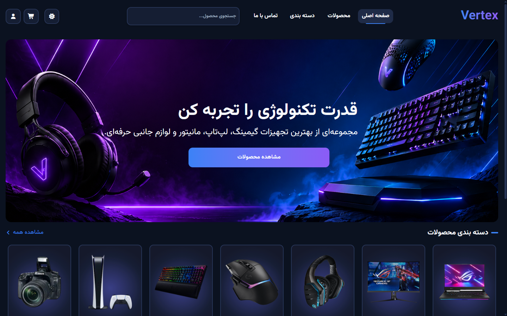
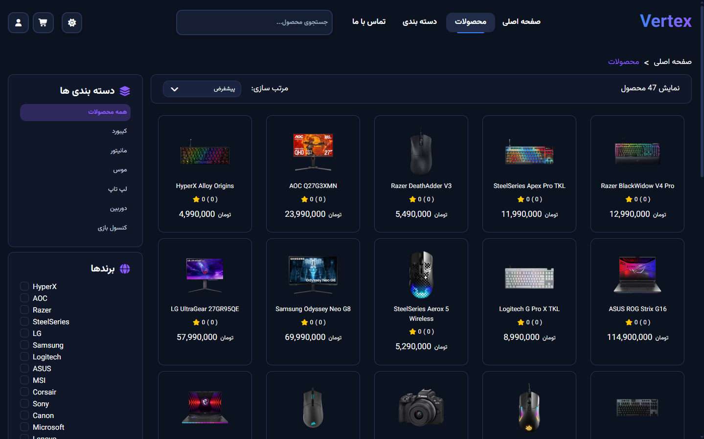
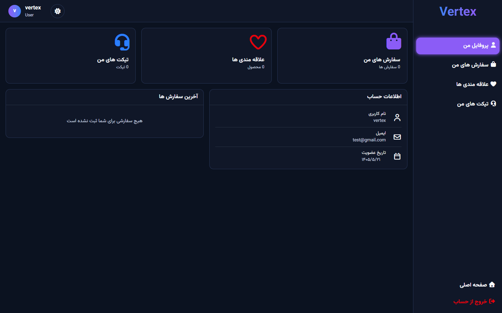
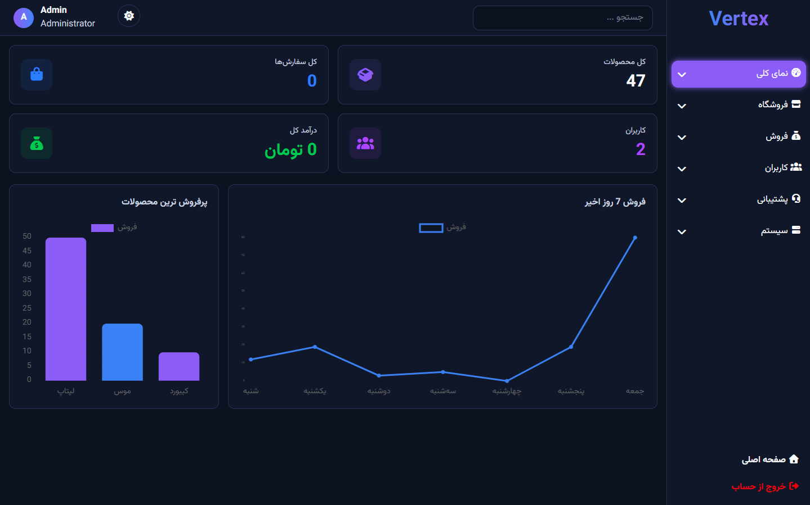

# Vertex Store

Vertex Store is a full-stack e-commerce application developed to practice real-world web development concepts.

The project includes a complete shopping experience with product browsing, filtering, searching, sorting, authentication, order management, user dashboard, and admin dashboard.

The frontend is built using Vanilla JavaScript and Tailwind CSS, while the backend uses Express.js, MongoDB, and JWT Authentication.

---

## 🔗 Live Demo

**Live Preview**

https://vertex-store-chi.vercel.app/

---

## 🚀 Tech Stack

### Frontend

* HTML5
* Tailwind CSS v4
* Vanilla JavaScript (ES6+)
* Chart.js
* Font Awesome
* Vite

### Backend

* Node.js
* Express.js
* MongoDB
* Mongoose
* JWT Authentication
* bcrypt.js

### Tools

* Git & GitHub
* Postman
* Vercel

---

## 📸 Screenshots

### Home Page



### Products Page



### User Dashboard



### Admin Dashboard



---

## ✨ Features

### 👤 User Features

* User Registration & Login
* JWT Authentication
* User Dashboard
* Profile Management
* Product Search
* Product Filtering
* Product Sorting
* Product Pagination
* Shopping Cart
* Order History
* Favorite Products
* Ticket System
* Responsive Design
* Dark / Light Theme
* Skeleton Loading
* Toast Notifications

### 🛠️ Admin Features

* Admin Dashboard
* Product Management
* Category Management
* Brand Management
* User Management
* Order Management
* Discount Code Management
* Comment Management
* Ticket Management
* Dashboard Statistics
* Sales Analytics
* Product Analytics
* Data Visualization with Chart.js

### 🎨 User Experience

* Responsive Layout
* Skeleton Loaders
* Toast Notification System
* Dark / Light Mode
* AOS Animations
* Empty States
* Loading States

---

## 🔐 Demo Admin Account

```txt
Email:    vertex-store@gmail.com
Password: admin12345678
```

---

## 📦 Installation

### Clone Repository

```bash
git clone https://github.com/Parham-Saravani/vertex-store.git
```

### Frontend

```bash
cd frontEnd
npm install
npm run dev
```

### Backend

```bash
cd backEnd
npm install
npm run dev
```

---

## 🎯 Project Goals

This project was developed to gain practical experience in:

* REST API Development
* Authentication & Authorization
* MongoDB Database Design
* Dashboard Development
* Admin Panel Architecture
* State Management using Vanilla JavaScript
* Real-world E-Commerce Workflows

---

## 📄 License

This project is developed for educational purposes.
